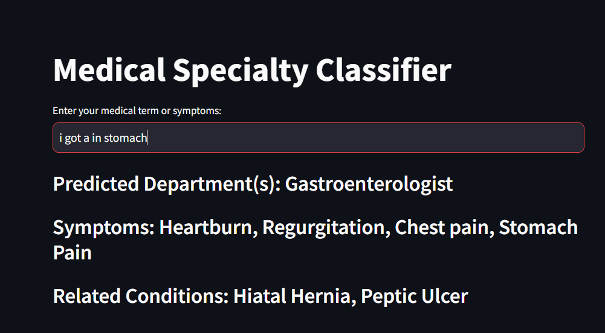

# Medical Department Classifier

## Problem Statment 
Develop a system that can accurately match a given medical term (representing an organ, disease, procedure, or related concept) to the appropriate medical department or specialty.

## Approach
This is a **Medical Department Classifier** built using **Streamlit** and **TF-IDF Vectorization** to predict relevant medical departments based on user-inputted medical terms or symptoms. It processes a dataset containing medical terms, symptoms, and associated departments, then finds the best match using **cosine similarity**.

## Features
- Loads medical terms and symptoms from a CSV file.
- Uses **TF-IDF vectorization** to analyze text similarity.
- Predicts the most relevant medical department(s) based on user input.
- Displays the best-matching symptoms and related conditions.
- Provides an easy-to-use **Streamlit** UI.

## Installation
To run this application, ensure you have Python installed and then install the required dependencies:

```bash
pip install streamlit pandas numpy scikit-learn streamlit
```
**or**
```bash
pip install -r requirements.txt
```

## Usage
1. **Prepare the dataset**:
   - The CSV file should contain the following columns:
        | **medical_terms** | **departments** | **dredicted department** | **Correct?** |
        |----------------------------------------------|------------------------|----------------------|--------------|
        | high blood pressure                         | Cardiology             | Cardiologist, Internal Medicine Specialist | ✅ (Correct) |
        | joint pain                                  | Rheumatology           | Orthopedic           | ✅ (Orthopedic is fine, but Rheumatology is more precise) |
        | shortness of breath                         | Pulmonology            | Pulmonologist, Cardiologist, Chest Physician | ✅ (Correct, multiple departments involved) |
        | blurry vision                               | Ophthalmology          | Optometrist           | ⚠️ (Close, but Ophthalmologist is more precise) |
        | numbness in hands and feet                  | Neurology              | Podiatrist (Foot Specialist) | ❌ (Incorrect, should be Neurology) |
        | unexplained weight loss                     | Endocrinology          | Oncologist, Surgical Oncologist | ⚠️ (Possible, but Endocrinology is more likely) |
        | stomach pain                      | Gastroenterology       | Gastroenterology | ❌ (Correct) |
        | difficulty swallowing                        | ENT / Gastroenterology | Pulmonologist, Cardiologist, Chest Physician | ❌ (Incorrect, should be ENT or Gastroenterology) |
        | skin rashes and itching                     | Dermatology            | Dermatologist         | ✅ (Correct) |
        | dizziness and balance issues                | Neurology / ENT        | Orthopedician         | ❌ (Incorrect, should be Neurology or ENT) |

    
2. **Run the application**:
   ```bash
   streamlit run app.py
   ```
   
3. **Interact with the classifier**:
   - Enter a medical term or symptom in the input box.
   - The app will return the predicted **department**, associated **symptoms**, and **related conditions**.

## Code Explanation
- **Loading Data**: Reads the CSV file and preprocesses the data.
- **TF-IDF Vectorization**: Converts text data into numerical vectors for similarity calculation.
- **Finding Best Match**: Computes cosine similarity between user input and dataset entries.
- **Streamlit UI**: Accepts user input and displays the prediction results.

## Example Output
### Input:
```
Chest Pain
```

### Output:
```
Predicted Department(s): Cardiologist, Pulmonologist
Symptoms: Tightness, Pressure, Radiating pain
Related Conditions: Heart Attack, GERD
```

## Screenshot



---

### Future Improvements
- Enhance dataset with more detailed medical conditions.
- Improve accuracy using advanced Sentence Bert or Trained on Robert for Context understanding and Better Classifications.
- Improving multi-label classification for cases involving multiple specialties.